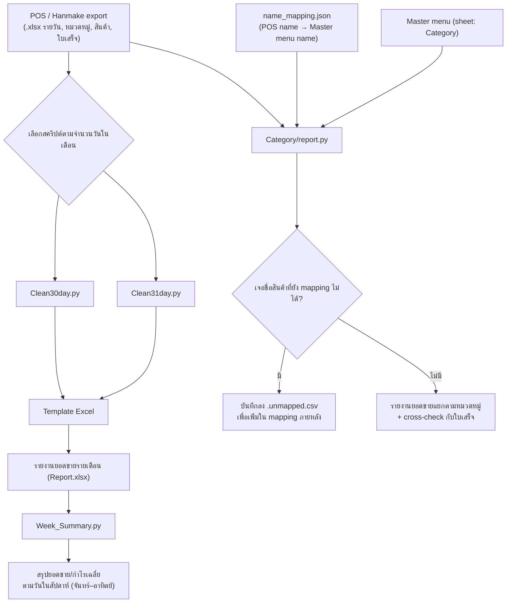

# Data-Clean

**Python data pipeline สำหรับทำความสะอาด (clean) และสรุปข้อมูลยอดขายจากระบบ POS / Hanmake**
แปลงไฟล์ export ดิบ (`.xlsx`) ที่มีรูปแบบไม่เป็นมาตรฐาน ให้กลายเป็นรายงาน Excel ที่พร้อมใช้งานจริง — รายวัน, รายสัปดาห์, และแยกตามหมวดหมู่สินค้า
---

## ที่มาของโปรเจกต์

ทุกเดือนร้านค้าจะได้ไฟล์ export ยอดขายจากระบบ POS หลายไฟล์ (ยอดขายรายวัน, หมวดหมู่, รายสินค้า, ช่วงเวลา, ใบเสร็จ) ซึ่ง**ไม่สามารถนำไปวิเคราะห์ต่อได้ทันที** เพราะ:

- โครงสร้างคอลัมน์ไม่ตรงกับ template ที่ใช้ทำรายงานจริง
- ต้องรวมข้อมูลจากหลายไฟล์เข้าด้วยกันเองทุกเดือน (เสียเวลา, เสี่ยงพลาด)
- ชื่อสินค้าจาก POS ไม่ตรงกับชื่อใน master menu ทำให้แยกยอดตามหมวดหมู่ไม่ได้ตรง ๆ

โปรเจกต์นี้จึงเขียนสคริปต์ขึ้นมาแทนขั้นตอน manual ทั้งหมด ให้กลายเป็น pipeline ที่รันคำสั่งเดียวจบ ลดเวลาทำรายงานจาก "ทำมือเป็นชั่วโมง" เหลือ "รันสคริปต์ไม่กี่วินาที"

---

## Flow การทำงาน



---

## ความสามารถหลัก

| สคริปต์ | หน้าที่ |
|---|---|
| **`Clean30day.py` / `Clean31day.py`** | อ่านไฟล์ export จาก POS (ยอดขายรายวัน, หมวดหมู่, สินค้า, ช่วงเวลา, ใบเสร็จ) มาคลีนและใส่ลง Template Excel เพื่อสร้างรายงานข้อมูลของเดือนนั้น ๆ เลือกใช้ตามจำนวนวันในเดือน |
| **`Week_Summary.py`** | สรุปยอดขาย/กำไรเฉลี่ยตามวันในสัปดาห์จากไฟล์ Excel รายเดือน เลือกได้ตั้งแต่ 1 เดือน, หลายเดือน, เป็นช่วง (`ม.ค.-มี.ค.`) หรือทั้งปี (`all`) |
| **`Category/`** | แบ่งยอดขายตามหมวดหมู่สินค้า โดย mapping ชื่อสินค้าจาก POS ให้ตรงกับ master menu (.xlsx) พร้อม cross-check ยอดกับไฟล์ใบเสร็จอัตโนมัติ และบันทึกชื่อที่ยัง mapping ไม่ได้ไว้ตรวจสอบภายหลัง |

**หลักการออกแบบที่ยึดตลอดทั้งโปรเจกต์:** ไฟล์ต้นฉบับ (input) จะไม่ถูกแก้ไขเด็ดขาด — ทุกสคริปต์สร้างไฟล์ผลลัพธ์ใหม่แยกต่างหากเสมอ เพื่อป้องกันข้อมูลดิบเสียหาย

---

## Tech Stack

- **Python 3.9+**
- **pandas** — จัดการและแปลงข้อมูลตาราง
- **openpyxl** — อ่าน/เขียนไฟล์ Excel รวมถึงการจัดฟอร์แมต template
- **SQLAlchemy + psycopg2-binary** — เชื่อมต่อฐานข้อมูล PostgreSQL (สำหรับต่อยอด/เก็บข้อมูลระยะยาว)

---

## โครงสร้างโปรเจกต์

```
Data-Clean/
├── Clean30day.py            # สร้างรายงานสำหรับเดือนที่มี 30 วัน
├── Clean31day.py            # สร้างรายงานสำหรับเดือนที่มี 31 วัน
├── Week_Summary.py          # สรุปยอดขาย/กำไรตามวันในสัปดาห์
├── requirements.txt
├── Template/
│   ├── Template30day.xlsx
│   └── Template31day.xlsx
└── Category/
    ├── pos_sales_pipeline.py   # ฟังก์ชันหลัก: โหลด master menu, mapping ชื่อสินค้า, cross-check
    ├── report.py               # CLI สำหรับรันสร้างรายงานยอดขายตามเมนู/หมวดหมู่
    └── name_mapping.json       # ตาราง mapping ชื่อสินค้าจาก POS -> ชื่อใน master menu ในไฟล์ (.xlsx)
```

---

## การติดตั้ง

ต้องมี **Python 3.9** ขึ้นไป จากนั้นติดตั้ง dependency ด้วยคำสั่ง

```bash
pip install -r requirements.txt
```

---

## วิธีใช้งาน

### 1. Clean30day.py / Clean31day.py

แก้ค่าตั้งต้น (`CONFIG`) ที่ต้นไฟล์ให้ตรงกับเดือนที่ต้องการ เช่น ชื่อเดือน, ช่วงวันที่, และชื่อไฟล์ `.xlsx` ที่ export มาจาก POS รวมถึง Template ที่จะใช้ จากนั้นวางไฟล์ที่เกี่ยวข้องไว้ในโฟลเดอร์เดียวกัน แล้วรัน

```bash
python Clean30day.py
# หรือ
python Clean31day.py
```

สคริปต์จะอ่านไฟล์ทั้งหมด คำนวณสรุปยอดขาย และสร้างไฟล์ Report Excel ใหม่ตามชื่อที่ตั้งไว้ใน `OUTPUT_FILE`
> โค้ดอิงจาก Template ที่มีอยู่ในระบบ (`Template/Template30day.xlsx`, `Template/Template31day.xlsx`)

### 2. Week_Summary.py

สรุปยอดขาย/กำไรเฉลี่ยตามวันในสัปดาห์ (จันทร์–อาทิตย์) จากไฟล์ Hanmake Excel ที่มีชีตแยกตามเดือน

```bash
# เดือนเดียว
python Week_Summary.py ไฟล์.xlsx --sheets "ก.ค."

# เป็นช่วงเดือน
python Week_Summary.py ไฟล์.xlsx --sheets "ม.ค.-มี.ค."

# ทั้งปี (ทุกชีตเดือน ม.ค.–ธ.ค. ที่มีในไฟล์)
python Week_Summary.py ไฟล์.xlsx --sheets all
```

**ชื่อชีตที่ใช้ได้ในช่วงเดือน:** `ม.ค.`, `ก.พ.`, `มี.ค.`, `เม.ย.`, `พ.ค.`, `มิ.ย.`, `ก.ค.`, `ส.ค.`, `ก.ย.`, `ต.ค.`, `พ.ย.`, `ธ.ค.`

ตัวเลือกเพิ่มเติม:
| Flag | คำอธิบาย |
|---|---|
| `--sheets` | **จำเป็น** ชีตที่ต้องการ: ชื่อเดียว, หลายชื่อคั่นคอมมา, ช่วง `ม.ค.-มี.ค.`, หรือ `all` |
| `--output` | ชื่อไฟล์ผลลัพธ์ (default: `<ชื่อไฟล์เดิม>_summary.xlsx`) |
| `--output-sheet` | ชื่อชีตสรุป (default: `สรุปวันขายดี`) |
| `--into-copy` | สร้างเป็นสำเนาของทั้งไฟล์แล้วเพิ่มชีตสรุปไว้หน้าสุด (ไม่ใส่ = ไฟล์ใหม่ที่มีเฉพาะชีตสรุป) ไฟล์ที่มีกราฟควรเปิดตรวจหลังสร้าง |
| `--skip-unfilled` | ไม่นับช่อง `-` ท้ายเดือน (หลังวันสุดท้ายที่มีข้อมูล) ว่าเป็นวันปิด ใช้กับเดือนปัจจุบันที่ยังไม่จบ |
| `--header-row` | แถวหัวตาราง (default: 5) |
| `--data-start-row` | แถวแรกของข้อมูลรายวัน (default: 6) |
| `--data-end-row` | แถวสุดท้ายที่สแกน (default: 40) แถวที่ไม่ใช่วันถูกข้ามเอง |
ผลลัพธ์จะถูกสร้างเป็นไฟล์ใหม่เสมอ (ไฟล์ต้นฉบับไม่ถูกแก้ไข) และถ้าไฟล์ผลลัพธ์เปิดค้างใน Excel อยู่ ต้องปิดก่อนรัน

### 3. Category/report.py

ใช้แบ่งยอดขายสินค้าตามหมวดหมู่ โดยอิงจากไฟล์ master menu (.xlsx) (ชีตชื่อ `Category`) และไฟล์ `name_mapping.json`

```bash
cd Category
ใส่ไฟล์ master menu(`.xlsx`) (ชีตชื่อ `Category`)
สร้างไฟล์ `name_mapping.json`

ตัวอย่างโครงสร้าง
  "Name Product POS": {
    "category": "...", ชื่อcatagoryของProduct
    "master_name": "..." ชื่อProductในmaster menu
  },
**ต้องมีชื่อสินค้าในระบบ POS และในไฟล์ชีต Category

python report.py
```
ตัวเลือกเพิ่มเติม:

| Flag | คำอธิบาย |
|---|---|
| `--category "ชื่อหมวดหมู่"` | กรองเฉพาะหมวดหมู่ที่ต้องการ (ไม่ระบุ = เอาทุกหมวด) , จะหาได้เฉพาะหมวดหมูในไฟล์ master menu มีเท่านั้น และต้องมีชื่อในไฟล์ `name_mapping.json` |

สคริปต์จะค้นหาไฟล์ `.xlsx`(master menu, ยอดขายตามสินค้า, ใบเสร็จ) จับคู่ชื่อสินค้าตาม mapping แล้วสร้างรายงานสรุปยอดขายตามเมนู หากมีไฟล์ใบเสร็จของเดือนนั้นด้วยจะ cross-check ยอดขายให้อัตโนมัติ และหากพบชื่อสินค้าที่ยัง mapping ไม่ได้ จะบันทึกไว้ใน `.unmapped.csv` เพื่อนำไปเพิ่มใน `name_mapping.json` ต่อไป

---

## ข้อจำกัด / หมายเหตุ

- สคริปต์ทั้งหมดออกแบบมาให้ใช้กับไฟล์ export จากระบบ POS ที่มีโครงสร้างคอลัมน์เฉพาะของธุรกิจนี้ หากนำไปใช้กับข้อมูลรูปแบบอื่นอาจต้องปรับชื่อคอลัมน์/ตำแหน่งข้อมูลในโค้ดให้ตรงกัน
- ไฟล์ต้นฉบับ (input) จะไม่ถูกแก้ไข ทุกสคริปต์สร้างไฟล์ผลลัพธ์ใหม่แยกต่างหากเสมอ
---